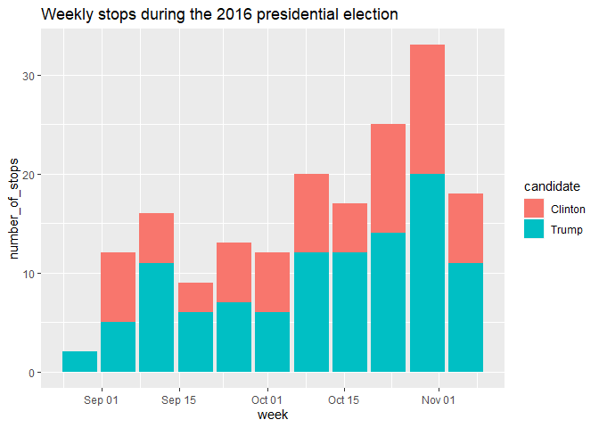

Allie’s First Repo
================

## GitHub Documents :D

This is an **R Markdown** *format* used for publishing markdown
documents to GitHub. When you click the **Knit** button all R code
chunks are run and a markdown file (.md) suitable for publishing to
GitHub is generated.

## Including Code

You can include R code in the document as follows:

``` r
weekly_campaign_stops <- pres_2016_trail %>% 
  mutate(week = floor_date(date, unit = "week")) %>% 
  group_by(candidate, week) %>% 
  summarize(number_of_stops = n())
```

    ## `summarise()` has grouped output by 'candidate'. You can override using the `.groups` argument.

## Including Plots

# This is a plot

You can also embed plots, for example:

<!-- -->

Note that the `echo = FALSE` parameter was added to the code chunk to
prevent printing of the R code that generated the plot.

# :\]
